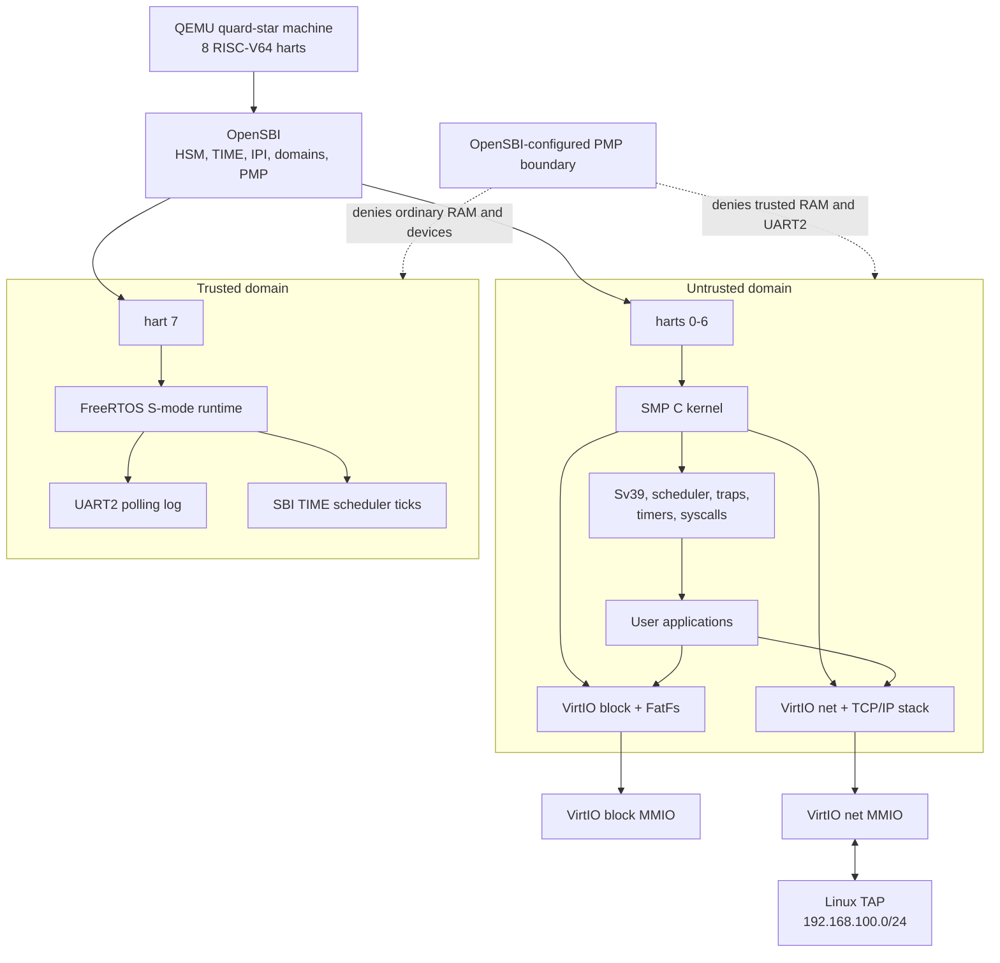
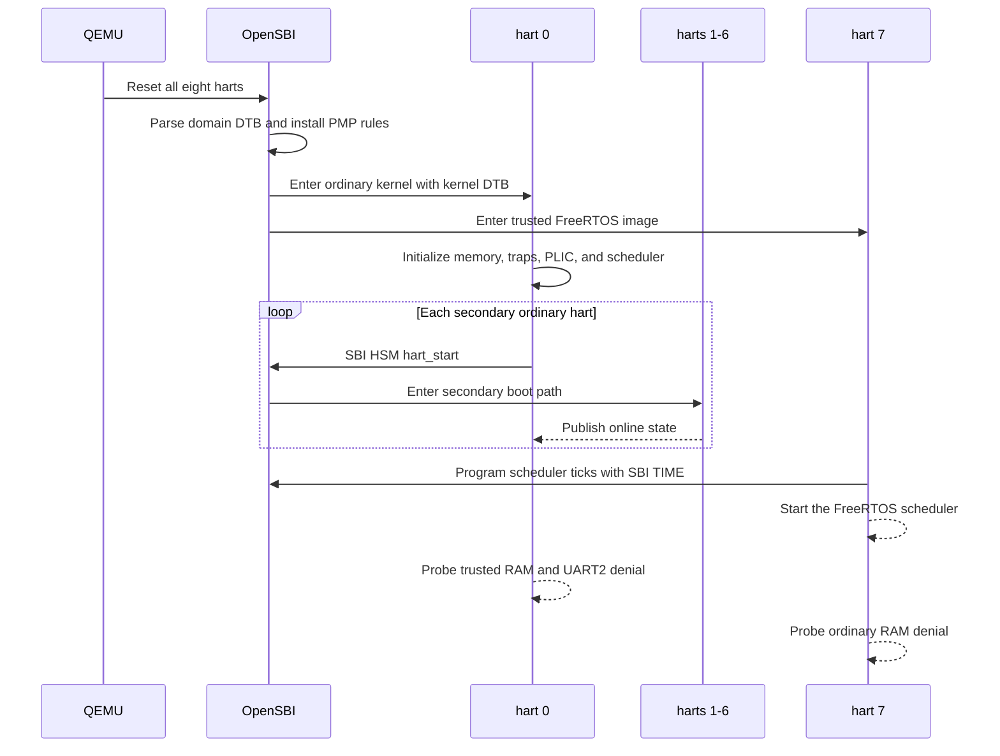
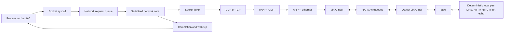
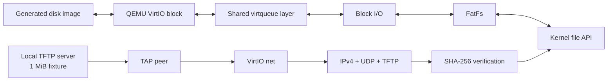
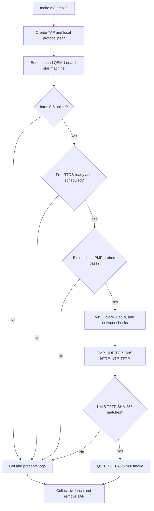
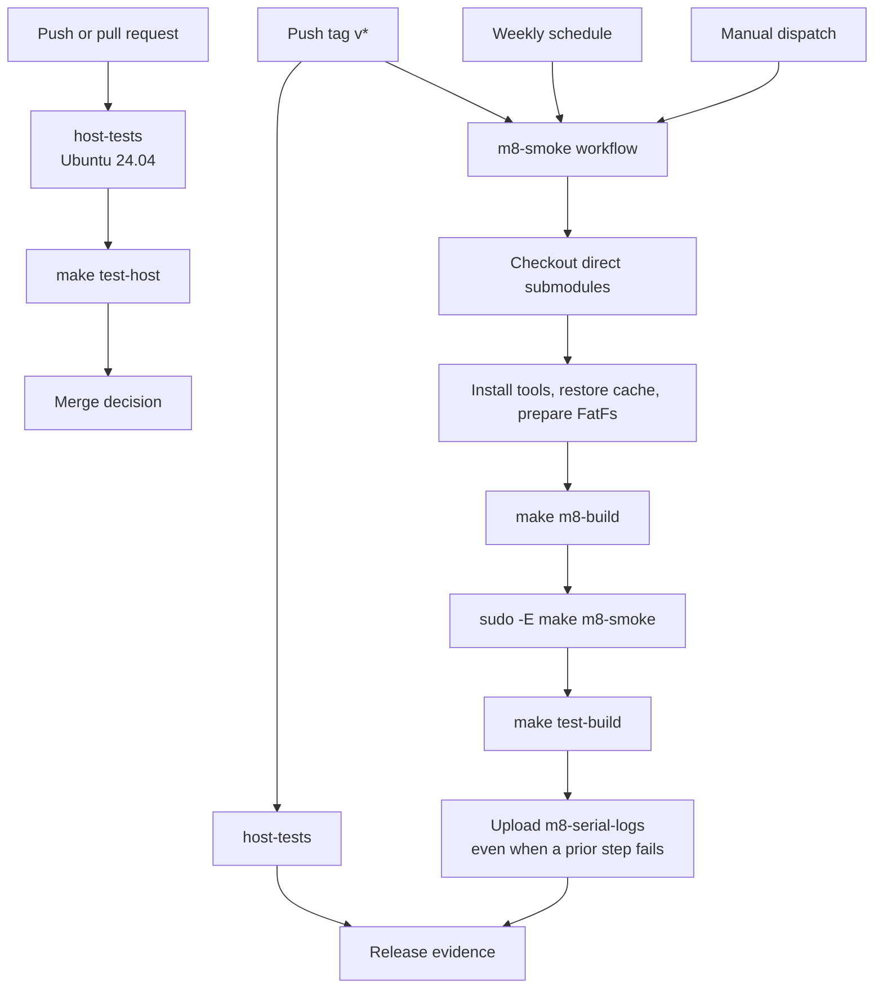
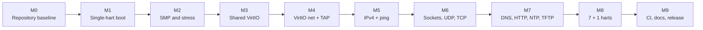

# quard-star-riscv64-net

**English** | [简体中文](README.zh-CN.md)

[](https://github.com/Quchaosheng/quard-star-riscv64-net/actions/workflows/host-tests.yml)
[](https://github.com/Quchaosheng/quard-star-riscv64-net/actions/workflows/m8-smoke.yml)
[](https://github.com/Quchaosheng/quard-star-riscv64-net/releases/latest)
[](LICENSE)

A C-language RISC-V64 SMP operating system for the custom QEMU quard-star
machine. Its kernel/platform code and TCP/IP core were selectively migrated
from the fixed historical revisions documented in [Source Migration](docs/source-migration.md);
those source repositories are currently unavailable, so the revisions are
provenance records rather than independently retrievable inputs. The design
draws on rCore-Tutorial, while the in-tree TCP/IP core has the single source
baseline recorded there. The project combines a C kernel, OpenSBI domain
configuration, a dedicated FreeRTOS trusted hart, VirtIO block and network
devices, and FatFs.

The current M8 configuration boots seven harts running the SMP kernel and one
isolated FreeRTOS hart. Its reproducible QEMU/TAP acceptance test covers SMP,
storage, networking, application protocols, trusted scheduling, and
QEMU-observed PMP-enforced memory isolation configured through OpenSBI domains;
it does not depend on the public Internet.

## QEMU demo

<a href="docs/assets/qemu-m8-demo.mp4"></a>

Animated preview from the committed evidence replay. Click it to open the full 42-second MP4.

The 42-second video is generated from a real, passing M8 run. Every displayed
result is validated against `qemu.log`, `trusted.log`, and `m5-peer.stats`
before rendering. It is a post-processed evidence replay, not a screen
recording or a live QEMU/terminal capture: ffmpeg synthesizes the frames with
`drawbox` and subtitles from the validated summary. The accompanying [evidence
manifest](docs/assets/qemu-m8-demo-evidence.json) records the source and media
SHA-256 digests; the media itself is not additional runtime evidence.

Reproduce the complete run and video on Ubuntu 24.04 or WSL2. The environment
check also accepts 26.04, but current CI and retained run evidence cover 24.04
only:

```sh
make demo
```

To render again from an already accepted `out/m8` artifact set, use
`make demo-render`. See [QEMU Demo](docs/qemu-demo.md) for requirements,
validation rules, and generated files. Scheduled and release-tag M8 workflows
also regenerate the media and include it in the `m8-serial-logs` artifact.

## At a glance

| Area | Implemented scope |
| --- | --- |
| CPU | RISC-V64, harts 0-6 in one SMP kernel, hart 7 in a separate FreeRTOS domain |
| Firmware | OpenSBI HSM, TIME, IPI, domain configuration, and QEMU-verified PMP access restrictions |
| Kernel | Sv39, per-hart state, scheduler, migration, traps, timers, syscalls, and synchronization |
| Storage | Shared VirtIO MMIO/virtqueue layer, VirtIO block, FatFs, and generation-checked file handles |
| Networking | VirtIO net, Ethernet, ARP, IPv4, ICMP, UDP, tested TCP subset, loopback, and sockets |
| Applications | Ping, UDP checks, HTTP over TCP, DNS, NTP, and TFTP with a 1 MiB SHA-256-verified transfer |
| Trusted runtime | FreeRTOS S-mode scheduler on hart 7, trusted RAM, UART2, and SBI timer ticks |
| Verification | Host tests, QEMU/TAP smoke tests, stable serial markers, stress tests, and performance reports |

## System architecture



OpenSBI gives the ordinary kernel and trusted runtime different CPU and device
views. Hart 7 never joins the kernel allocator, scheduler, locks, interrupt
routing, or network stack. The current security evidence is QEMU-only; see
[Current Limitations](docs/limitations.md) for the exact claim boundary.

### Boot and isolation flow



M8 requires load, store, and instruction faults in both directions. Resource
boundaries are declared by the OpenSBI domain DTS files, and the repository's
fault probes exercise the denied accesses before emitting the summary markers
`QS:PMP_UNTRUSTED_DENY_OK` and `QS:PMP_TRUSTED_DENY_OK`; trusted scheduling is
accepted only after `QS:TRUSTED_SCHED_OK` appears on UART2.

## Data paths

### Socket and network flow

TCP/IP protocol state is owned by one network core thread. Processes may run on
any ordinary hart, but socket operations cross a request queue before mutating
network state.



### Storage and file-transfer flow



The M8 build always regenerates its disk image. This prevents a stale or full
image from changing the result of the TFTP and FatFs acceptance path.

## Quick start

### Supported environment

- Ubuntu 24.04, directly or through WSL2 (current CI and retained run evidence).
- Ubuntu 26.04 may pass `make check-env`, but it is not a current CI or retained
  acceptance-evidence target.
- A RISC-V bare-metal GCC/binutils toolchain.
- Build tools and development headers checked by `make check-env`.
- Linux TUN/TAP permissions for QEMU end-to-end tests.

Native Windows networking is not an acceptance environment. Use WSL2 when the
repository is hosted on Windows.

### Prepare dependencies

```sh
git clone --recurse-submodules \
  https://github.com/Quchaosheng/quard-star-riscv64-net.git
cd quard-star-riscv64-net

make check-env
make deps
```

`make deps` initializes the locked direct submodules and retrieves the FatFs
archive recorded in `third_party/fatfs.lock`.

### Run host tests

```sh
make test-host
```

Host tests execute only the host-side scripts and contract checks registered
under `test-host` in the Makefile. The separate `test-build` target is an
artifact-dependent build contract and is not part of host-only testing. Host
tests do not start QEMU, create a TAP interface, or boot the system; the
system itself starts through `make run` or `make m8-smoke`.

The `test-host` target contains 85 shell checks: 64 behavior, script, and
runtime checks plus 21 source-contract checks. The separate `test-build`
target adds one artifact-dependent build contract. These are script counts,
not claims about individual assertions or QEMU runtime cases.

### Build and run the complete system

```sh
make m8-build
sudo -E make m8-smoke
```

`make m8-build` produces artifacts under `out/m8`. The direct
`sudo -E make m8-smoke` command is the source-tied full acceptance entry used
by CI. `make run` is only a convenience wrapper for rerunning cached
artifacts: it checks for three files, does not rebuild, and does not verify
that those files came from the current worktree or `HEAD`. A passing `make run`
therefore proves the cached artifact run, not necessarily the current source.

The smoke test creates and configures `tap0`, starts deterministic local
protocol peers, boots the full eight-hart machine, checks all stable markers,
and removes its networking resources on exit. Public DNS and Internet access
are not required.

### Inspect results

M8 writes its evidence under `out/m8`:

| File | Contents |
| --- | --- |
| `kernel.log` | OpenSBI and ordinary kernel UART output |
| `trusted.log` | FreeRTOS hart 7 UART2 output |
| `qemu.log` | Combined smoke-test console capture |
| `qemu.err` | QEMU diagnostics |
| `m5-peer.stats` | TAP peer counters and transfer observations |

A successful run contains `QS:TEST_PASS:m8-smoke`. A `QS:TEST_FAIL` marker
takes precedence over any later output. For debugging commands and marker
interpretation, use [Build and Debug](docs/build-debug.md).

## Acceptance flow



| Gate | Required evidence |
| --- | --- |
| SMP | `QS:HART_ONLINE:0` through `QS:HART_ONLINE:6` |
| Trusted boot | `QS:TRUSTED_READY` |
| Trusted scheduling | `QS:TRUSTED_SCHED_OK` after scheduler ticks |
| Ordinary-domain denial | OpenSBI-configured PMP permissions; `QS:PMP_UNTRUSTED_DENY_OK` plus load/store/execute markers |
| Trusted-domain denial | OpenSBI-configured PMP permissions; `QS:PMP_TRUSTED_DENY_OK` plus load/store/execute markers |
| File transfer | `QS:M7E_TFTP_1M_OK` and peer counters with no outstanding packets |
| Overall result | `QS:TEST_PASS:m8-smoke` and no `QS:TEST_FAIL` |

## CI and release flow



GitHub Actions runs host tests on every push and pull request. The host job is
host-only and does not establish QEMU, TAP, networking, or PMP evidence. M8
runs weekly, on manual dispatch, and automatically for every `v*` release tag;
it is not a full QEMU gate for every branch push or pull request. Tag releases
therefore have both fast host-test evidence and full QEMU/TAP evidence at the
exact tagged commit when the M8 job passes.

The `host-tests` job's `make test-host` command is host-only and runs the
scripts registered under `test-host`; it never starts QEMU or TAP. The M8 job
starts the system only after `make m8-build`, by running the direct
`sudo -E make m8-smoke` target, and then runs `make test-build`. Runtime claims
must be taken from the M8 job's serial logs, peer statistics, smoke exit status,
and uploaded artifacts; `make test-build` is a build contract check, not a
replacement for the smoke run.

## Implementation milestones



The staged `m1-*` through `m8-*` scripts remain available for focused
regression and fault isolation. The current release target is the cumulative
M8 configuration.

## Repository map

| Path | Responsibility |
| --- | --- |
| `kernel/` | SMP kernel, drivers, FatFs port, file layer, and TCP/IP stack |
| `user/` | User applications linked into the test image |
| `trusted/` | FreeRTOS S-mode platform, port, scheduler demo, and UART2 driver |
| `platform/quard-star/` | Shared memory map, boot assets, and domain/kernel DTS files |
| `scripts/` | Environment, dependency, staged build, smoke, stress, TAP, and report tooling |
| `tests/host/` | Host unit, behavior, script, and contract tests |
| `.github/workflows/` | Fast host CI and full M8 QEMU/TAP CI |
| `third_party/` | Pinned upstream submodules and the locked FatFs source archive |
| `patches/` | Project-owned QEMU and OpenSBI integration patches |
| `docs/` | Design, build, migration, limitations, and performance documentation |

Third-party versions and licenses are recorded in [THIRD_PARTY.md](THIRD_PARTY.md).
First-party migration baselines are recorded in
[Source Migration](docs/source-migration.md).

## Performance reports

Validated reports can be generated from M8 integration artifacts or cumulative
M6C2 TCP stress artifacts:

```sh
python3 scripts/perf-baseline.py --help
```

The reporter accepts only the supported `m8` and `m6c2-stress` stages and
updates its JSON and Markdown outputs transactionally. Timing is an observation
for comparable environments, not a cross-host CI pass threshold. See
[Performance Baselines](docs/performance-baseline.md) for collection and
comparison rules.

## Release status

The current release is `v1.0.2`. It is verified by host CI and by the M8
QEMU/TAP acceptance workflow at the exact release commit.

`v1.0.2` is a maintenance release that makes release tags run the full M8
acceptance workflow and hardens performance-report validation and output
rollback. It retains the `v1.0.1` maintenance work and does not expand the
`v1.0.0` protocol or hardware-support boundary.

`v1.0.0` introduced the S-mode FreeRTOS scheduler on hart 7 and the
OpenSBI-domain configuration whose PMP permissions are exercised bidirectionally
in QEMU. Hart 7 receives an 8 MiB trusted RAM region and UART2; harts 0-6 are
denied both resources in the tested QEMU model.

## Current boundaries

- IPv4 only: no IPv6, DHCP, TLS, HTTPS, or network offloads.
- TCP is a tested subset, not a complete RFC implementation. The cumulative M8 acceptance exercises the client-side TCP path through HTTP; dedicated `m6c1-smoke`, `m6c2-smoke`, and `m6c2-stress` runs cover the separately tested handshake, sequence/acknowledgement, retransmission, close, listen/accept, echo, and stress paths. Passive-close paths are simplified. Transmission is stop-and-wait with one payload segment up to 512 B and a fixed 500 ms RTO; TCP options, congestion control, RTT estimation, and SACK are not implemented.
- Fixed `192.168.100.0/24` acceptance network; public connectivity is optional.
- The TFTP implementation covers the tested read path and `windowsize=4`.
- The file layer is a small FatFs test interface, not a POSIX VFS.
- Isolation results cover the QEMU model, not physical hardware, DMA, or side channels.
- Native Windows TAP networking is outside the acceptance environment.

Read [Current Limitations](docs/limitations.md) before extending the security or
protocol claims.

## Documentation

| Document | Use it for |
| --- | --- |
| [Design and Implementation](docs/quard-star-riscv64-net-design.md) | Detailed architecture, resource contracts, milestones, and acceptance criteria |
| [Build and Debug](docs/build-debug.md) | Environment setup, commands, logs, GDB, and failure triage |
| [QEMU Demo](docs/qemu-demo.md) | Reproduce or re-render the verified M8 video |
| [Current Limitations](docs/limitations.md) | Security, protocol, platform, and testing boundaries |
| [Performance Baselines](docs/performance-baseline.md) | Artifact reporting and comparison rules |
| [Source Migration](docs/source-migration.md) | First-party code provenance and migration baselines |
| [Third-Party Inventory](THIRD_PARTY.md) | Dependency revisions and licenses |

## Acknowledgements

The kernel design draws on ideas from Tsinghua University's open-source rCore
project. Thanks to the rCore contributors for making operating-system concepts
and implementation techniques accessible to learners. Code provenance is
described in [Source Migration](docs/source-migration.md).

Project-owned code is distributed under the repository [MIT License](LICENSE).
Bundled third-party components retain their upstream licenses.
