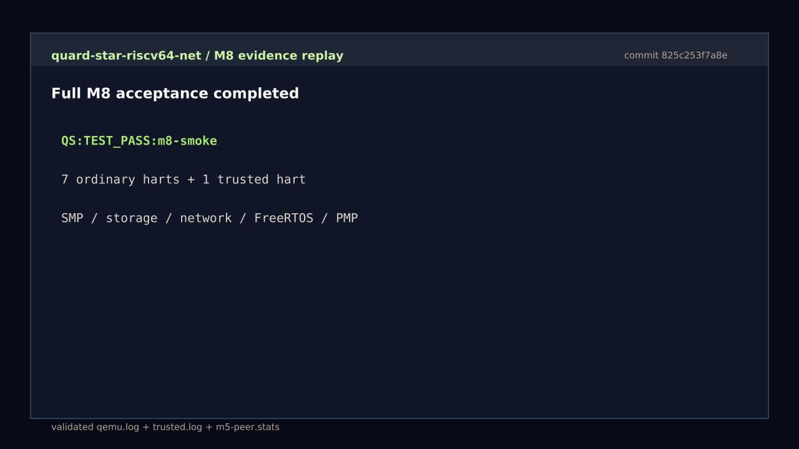
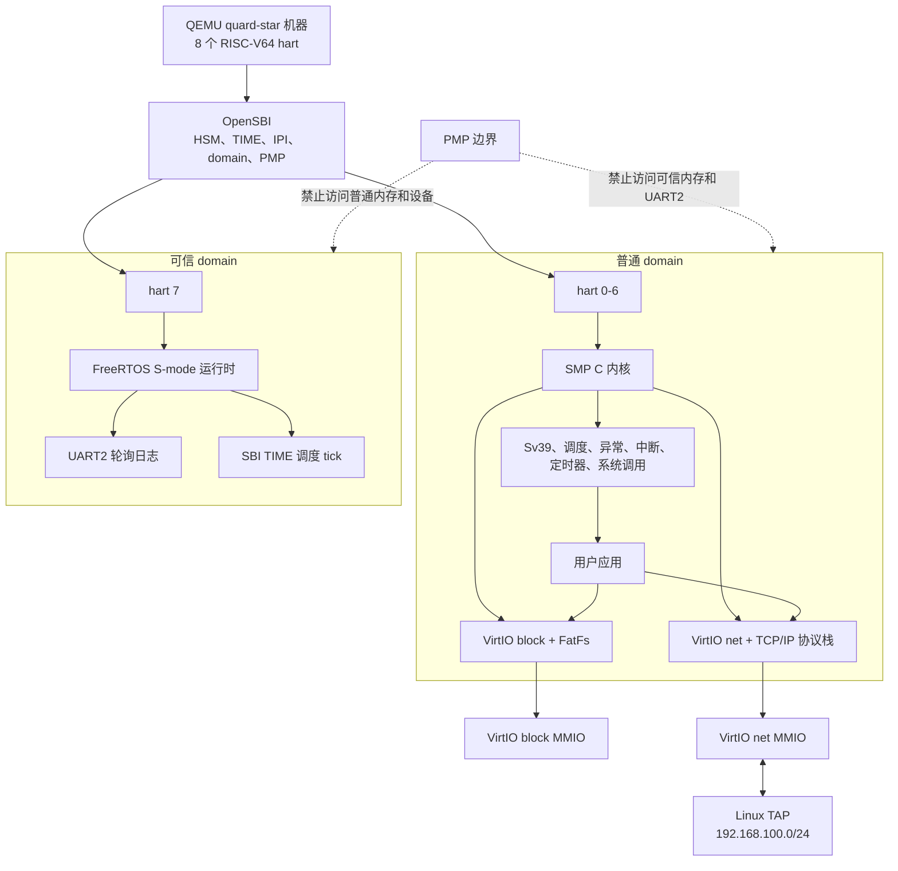
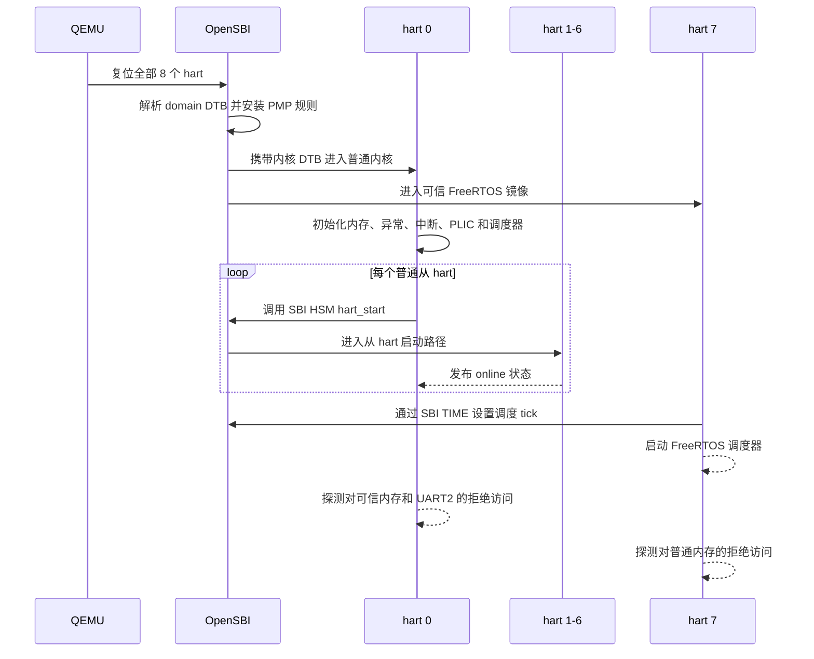
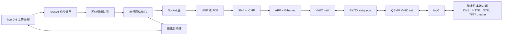
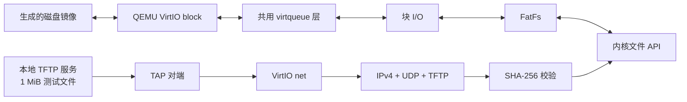
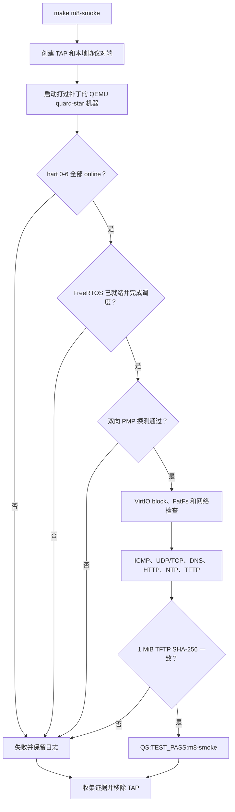
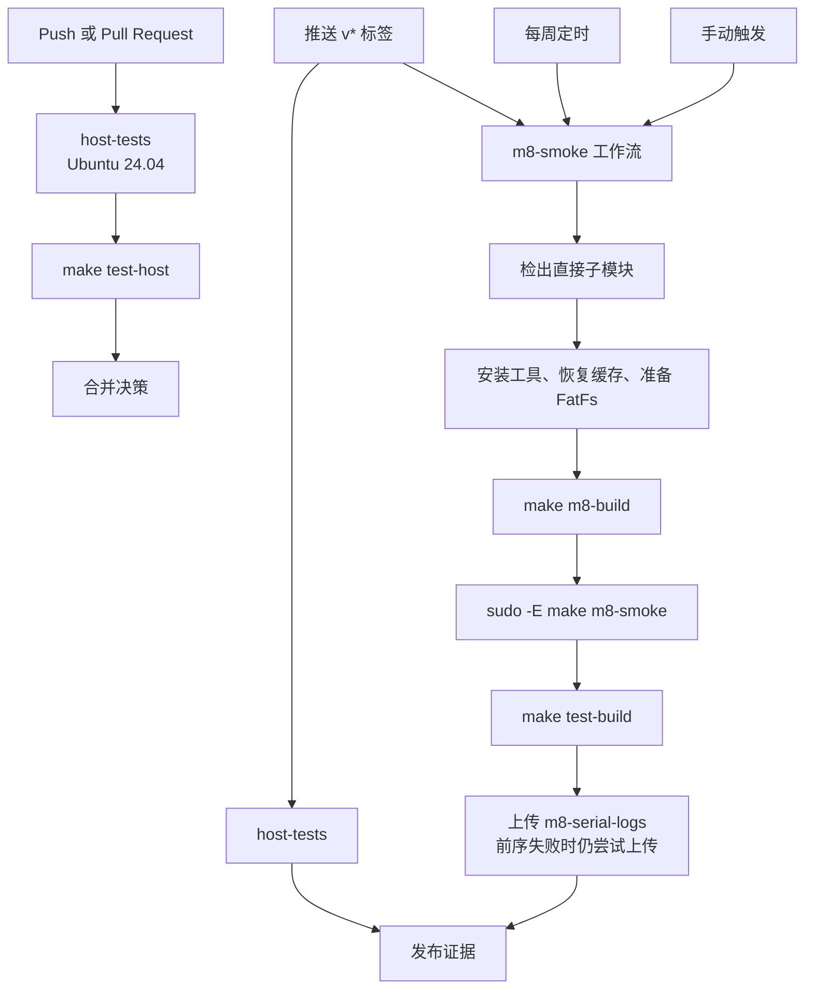
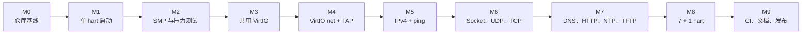

# quard-star-riscv64-net

[English](README.md) | **简体中文**

[](https://github.com/Quchaosheng/quard-star-riscv64-net/actions/workflows/host-tests.yml)
[](https://github.com/Quchaosheng/quard-star-riscv64-net/actions/workflows/m8-smoke.yml)
[](https://github.com/Quchaosheng/quard-star-riscv64-net/releases/latest)
[](LICENSE)

这是一个面向教学与实验的 RISC-V64 SMP 操作系统，运行于定制的 QEMU
quard-star 机器。项目包含独立实现的 C 内核、OpenSBI domain、专用的
FreeRTOS 可信 hart、VirtIO 块设备与网络设备、FatFs，以及一个小型自研
TCP/IP 协议栈。

完整的 M8 系统会启动 7 个普通内核 hart 和 1 个隔离的 FreeRTOS hart。
确定性的 QEMU/TAP 验收测试覆盖 SMP、存储、网络、应用协议、可信调度和
PMP 内存隔离，运行过程不依赖公网。

## QEMU 演示

[](docs/assets/qemu-m8-demo.mp4)

这段 42 秒视频由一次真实通过的 M8 运行生成。渲染前，脚本会校验
`qemu.log`、`trusted.log` 和 `m5-peer.stats` 中的每一项展示结果，因此它是
验收证据回放，而不是手工制作的成功动画。配套的
[证据清单](docs/assets/qemu-m8-demo-evidence.json)记录了源文件和媒体文件的
SHA-256 摘要。

在 Ubuntu 24.04/26.04 或 WSL2 中完整复现运行和视频：

```sh
make demo
```

若 `out/m8` 中已有通过验收的产物，可用 `make demo-render` 重新渲染。
依赖、校验规则和输出文件见 [QEMU 演示说明](docs/qemu-demo.zh-CN.md)。定时、
手动和发布标签触发的 M8 工作流也会重新生成媒体，并将其放入
`m8-serial-logs` 产物包。

## 项目概览

| 领域 | 已实现范围 |
| --- | --- |
| CPU | RISC-V64；hart 0-6 运行同一个 SMP 内核，hart 7 运行独立 FreeRTOS domain |
| 固件 | OpenSBI HSM、TIME、IPI、domain 配置和 PMP 隔离 |
| 内核 | Sv39、每 hart 状态、调度、迁移、异常、中断、定时器、系统调用和同步 |
| 存储 | 共用 VirtIO MMIO/virtqueue 层、VirtIO block、FatFs 和带代次校验的文件句柄 |
| 网络 | VirtIO net、Ethernet、ARP、IPv4、ICMP、UDP、TCP、回环和 socket |
| 应用 | Ping、UDP/TCP echo、DNS、HTTP、NTP，以及带 SHA-256 校验的 1 MiB TFTP 传输 |
| 可信运行时 | hart 7 上的 FreeRTOS S-mode 调度器、可信内存、UART2 和 SBI 定时器 tick |
| 验证 | 主机测试、QEMU/TAP 冒烟测试、稳定串口标记、压力测试和性能报告 |

## 系统架构



OpenSBI 为普通内核和可信运行时提供不同的 CPU 与设备视图。hart 7 不会加入
普通内核的分配器、调度器、锁、中断路由或网络栈。当前安全证据仅适用于 QEMU
模型，精确边界见[当前限制](docs/limitations.zh-CN.md)。

### 启动与隔离流程



M8 要求两个方向的读取、写入和取指访问均产生 fault。普通侧和可信侧的汇总
标记分别是 `QS:PMP_UNTRUSTED_DENY_OK` 与 `QS:PMP_TRUSTED_DENY_OK`；只有
UART2 出现 `QS:TRUSTED_SCHED_OK` 后，可信调度才算通过。

## 数据路径

### Socket 与网络流程

TCP/IP 协议状态由一个网络核心线程集中管理。进程可在任意普通 hart 上运行，
但 socket 操作必须通过请求队列，之后才能修改网络状态。



### 存储与文件传输流程



M8 构建始终重新生成磁盘镜像，避免旧镜像或已写满镜像改变 TFTP 与 FatFs
验收路径的结果。

## 快速开始

### 支持环境

- Ubuntu 24.04 或 26.04，可直接运行，也可使用 WSL2。
- RISC-V bare-metal GCC/binutils 工具链。
- `make check-env` 检查的构建工具与开发头文件。
- QEMU 端到端测试所需的 Linux TUN/TAP 权限。

原生 Windows 网络不属于验收环境。仓库位于 Windows 时请使用 WSL2。

### 准备依赖

```sh
git clone --recurse-submodules \
  https://github.com/Quchaosheng/quard-star-riscv64-net.git
cd quard-star-riscv64-net

make check-env
make deps
```

`make deps` 会初始化锁定版本的直接子模块，并获取
`third_party/fatfs.lock` 中记录的 FatFs 压缩包。

### 运行主机测试

```sh
make test-host
```

主机测试不会启动 QEMU，也不会创建 TAP 接口。测试范围包括契约、解析器、
队列、协议行为、socket 生命周期、脚本和 CI 策略。

### 构建并运行完整系统

```sh
make m8-build
sudo -v
make m8-smoke
```

冒烟测试会创建并配置 `tap0`，启动确定性的本地协议对端，启动完整的 8-hart
机器，检查所有稳定标记，并在退出时清理网络资源。无需公网 DNS 和互联网连接。

### 查看结果

M8 将证据写入 `out/m8`：

| 文件 | 内容 |
| --- | --- |
| `kernel.log` | OpenSBI 和普通内核 UART 输出 |
| `trusted.log` | FreeRTOS hart 7 的 UART2 输出 |
| `qemu.log` | 冒烟测试合并控制台输出 |
| `qemu.err` | QEMU 诊断信息 |
| `m5-peer.stats` | TAP 对端计数器和传输观测值 |

成功运行必须包含 `QS:TEST_PASS:m8-smoke`。任何 `QS:TEST_FAIL` 都优先于后续
输出。调试命令和标记解释见[构建与调试](docs/build-debug.zh-CN.md)。

## 验收流程



| 验收门槛 | 必需证据 |
| --- | --- |
| SMP | `QS:HART_ONLINE:0` 至 `QS:HART_ONLINE:6` |
| 可信启动 | `QS:TRUSTED_READY` |
| 可信调度 | 调度 tick 后出现 `QS:TRUSTED_SCHED_OK` |
| 普通 domain 拒绝访问 | `QS:PMP_UNTRUSTED_DENY_OK` 及读、写、取指标记 |
| 可信 domain 拒绝访问 | `QS:PMP_TRUSTED_DENY_OK` 及读、写、取指标记 |
| 文件传输 | `QS:M7E_TFTP_1M_OK`，且对端无未完成数据包 |
| 总体结果 | `QS:TEST_PASS:m8-smoke` 且不存在 `QS:TEST_FAIL` |

## CI 与发布流程



GitHub Actions 在每次 push 和 Pull Request 时运行主机测试。M8 每周运行、可
手动触发，并会为每个 `v*` 发布标签自动运行。因此，发布标签在同一提交上同时
具备快速主机测试证据和完整 QEMU/TAP 证据。

## 实施里程碑



分阶段的 `m1-*` 到 `m8-*` 脚本仍可用于针对性回归和故障定位。当前发布目标
是累计功能完整的 M8 配置。

## 仓库结构

| 路径 | 职责 |
| --- | --- |
| `kernel/` | SMP 内核、驱动、FatFs 移植、文件层和 TCP/IP 协议栈 |
| `user/` | 链接进测试镜像的用户应用 |
| `trusted/` | FreeRTOS S-mode 平台、移植层、调度演示和 UART2 驱动 |
| `platform/quard-star/` | 共用内存映射、启动资源和 domain/内核 DTS 文件 |
| `scripts/` | 环境、依赖、分阶段构建、冒烟、压力、TAP 和报告工具 |
| `tests/host/` | 主机单元、行为、脚本和契约测试 |
| `.github/workflows/` | 快速主机 CI 和完整 M8 QEMU/TAP CI |
| `third_party/` | 固定版本的上游子模块和锁定的 FatFs 源码包 |
| `patches/` | 项目自有的 QEMU 与 OpenSBI 集成补丁 |
| `docs/` | 设计、构建、迁移、限制和性能文档 |

第三方版本与许可证记录在 [THIRD_PARTY.md](THIRD_PARTY.md)。自有源码迁移
基线记录在[源码迁移](docs/source-migration.zh-CN.md)。

## 性能报告

可从 M8 集成测试产物或 M6C2 TCP 累计压力测试产物生成校验后的报告：

```sh
python3 scripts/perf-baseline.py --help
```

报告工具仅接受 `m8` 和 `m6c2-stress` 阶段，并以事务方式更新 JSON 与
Markdown 输出。时间数据只用于可比环境中的观测，不是跨主机 CI 通过阈值。
采集与比较规则见[性能基线](docs/performance-baseline.zh-CN.md)。

## 发布状态

当前版本为 `v1.0.2`，其精确发布提交已通过主机 CI 和 M8 QEMU/TAP 验收。

`v1.0.2` 是维护版本，使发布标签执行完整 M8 验收工作流，并强化性能报告校验
和输出回滚。它保留 `v1.0.1` 的维护内容，不扩展 `v1.0.0` 的协议或硬件支持边界。

`v1.0.0` 在 hart 7 引入 S-mode FreeRTOS 调度器，以及 OpenSBI domain 间的
双向 PMP 隔离。hart 7 获得 8 MiB 可信内存和 UART2，hart 0-6 无权访问它们。

## 当前边界

- 仅支持 IPv4；未实现 IPv6、DHCP、TLS、HTTPS 和网络卸载。
- 验收网络固定为 `192.168.100.0/24`；公网连接是可选项。
- TFTP 仅覆盖已测试的读取路径和 `windowsize=4`。
- 文件层是小型 FatFs 测试接口，不是 POSIX VFS。
- 隔离结果仅覆盖 QEMU 模型，不代表物理硬件、DMA 或侧信道安全。
- 原生 Windows TAP 网络不属于验收环境。

扩展安全或协议声明前，请阅读[当前限制](docs/limitations.zh-CN.md)。

## 文档

| 文档 | 用途 |
| --- | --- |
| [设计与实施说明](docs/quard-star-riscv64-net-design.md) | 详细架构、资源契约、里程碑和验收标准 |
| [构建与调试](docs/build-debug.zh-CN.md) | 环境、命令、日志、GDB 和故障定位 |
| [QEMU 演示](docs/qemu-demo.zh-CN.md) | 复现或重新渲染已验证的 M8 视频 |
| [当前限制](docs/limitations.zh-CN.md) | 安全、协议、平台和测试边界 |
| [性能基线](docs/performance-baseline.zh-CN.md) | 产物报告和比较规则 |
| [源码迁移](docs/source-migration.zh-CN.md) | 自有代码来源和迁移基线 |
| [第三方清单](THIRD_PARTY.zh-CN.md) | 依赖版本与许可证 |

## 致谢

内核的教学设计受到清华大学开源 rCore 项目的启发。感谢 rCore 贡献者让操作
系统概念和实现技术更容易被学习者理解。本仓库中的内核是独立的 C 语言设计与
实现。

项目自有代码按仓库中的 [MIT License](LICENSE) 分发。捆绑的第三方组件保留
各自的上游许可证。
