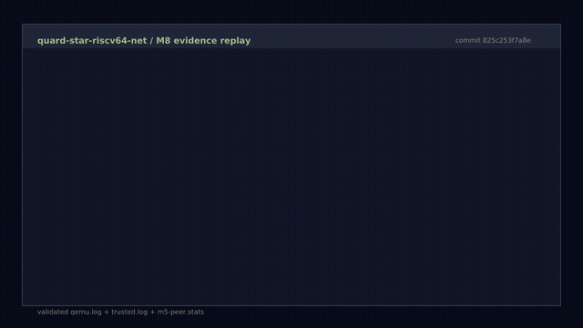

# QEMU 演示

[English](qemu-demo.md) | **简体中文**

README 中的视频是一次真实 M8 QEMU/TAP 验收运行的紧凑后处理回放。它不会
凭空制造成功结果：渲染器首先校验普通内核日志、可信 UART2 日志和 TAP 对端
统计，之后才把通过验收的证据制作成可读的 42 秒视频。输出本身由 FFmpeg
合成，不是屏幕录制，也不是 QEMU/终端的实时画面。

## 观看

<a href="assets/qemu-m8-demo.mp4"></a>

该预览动图由已提交 MP4 的原始帧生成；点击可打开完整的 42 秒视频。

仓库中的媒体采用 H.264 编码，分辨率 1280x720、30 fps、`yuv420p`，无音频。
源文件和输出文件摘要记录在
[qemu-m8-demo-evidence.json](assets/qemu-m8-demo-evidence.json) 中。

## 从头生成

直接使用 Ubuntu 24.04/26.04，或通过 WSL2 使用。除常规 M8 构建和 TAP 依赖
外，还需安装 `ffmpeg` 和 `ffprobe`：

```sh
sudo apt-get update
sudo apt-get install -y ffmpeg
make demo
```

`make demo` 按顺序执行：

1. 构建累计功能完整的 M8 固件。
2. 使用 `sudo` 运行完整的 8-hart QEMU/TAP 验收测试。
3. 检查内核、FreeRTOS、PMP、协议和 1 MiB TFTP 证据；缺失或重复均拒绝。
4. 渲染并校验视频与海报。
5. 写出机器可读的证据清单。

运行时验收不依赖公网 DNS 或互联网。TAP 对端提供确定性的本地 DNS、HTTP、
NTP、TFTP、ICMP 和 UDP 流量。

## 渲染已有证据

若 `make m8-smoke` 已通过，且产物仍位于 `out/m8`，可以跳过重新构建和运行：

```sh
make demo-render
```

渲染器读取：

- `out/m8/qemu.log`
- `out/m8/trusted.log`
- `out/m8/m5-peer.stats`

并写出：

- `docs/assets/qemu-m8-demo.mp4`
- `docs/assets/qemu-m8-demo.gif`
- `docs/assets/qemu-m8-demo-poster.png`
- `docs/assets/qemu-m8-demo-evidence.json`

## 校验边界

出现以下任一情况时，渲染会被拒绝：

- 必需标记缺失或重复。
- 任一日志包含 `QS:TEST_FAIL`。
- hart 0-6 未全部发布 online 标记。
- 可信调度或任一 PMP 汇总标记缺失。
- DNS、HTTP、NTP、ping 或 TFTP 验收不完整。
- 对端未观测到恰好 1 MiB、2049 个 TFTP 数据块与 ACK，或仍有未完成数据包。
- 输出不是 42 秒、1280x720、`yuv420p` 的 H.264 视频。

视频和预览动图是解释性产物，不是额外的验收权威，也不是运行过程的录屏。原始
日志、对端统计、冒烟测试退出状态和 CI 产物仍是权威证据。

定时、手动和发布标签触发的 M8 工作流会在冒烟验收通过后使用相同的渲染器和格式
生成媒体。重新生成的 MP4、海报、证据 JSON、串口日志和对端统计会一起上传到
`m8-serial-logs` 工作流产物。
